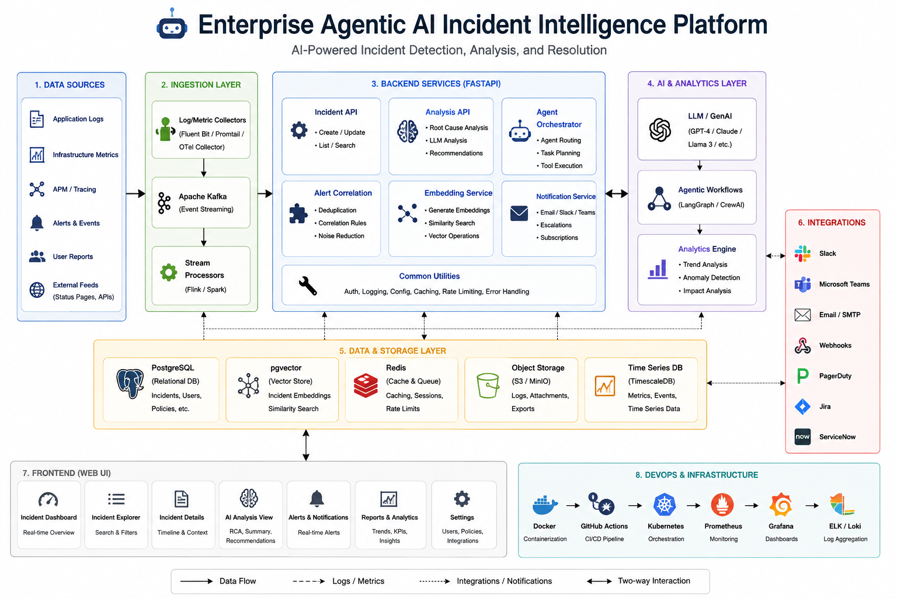

# Enterprise Agentic AI Incident Intelligence Platform

A production-style **Agentic AI incident intelligence platform** that uses **FastAPI, LangGraph, OpenAI, PostgreSQL, pgvector, React, and Docker** to investigate production incidents, retrieve relevant operational knowledge, evaluate AI-generated diagnoses, enforce safety guardrails, and require human approval before remediation.

## System Architecture



The platform uses a layered architecture combining FastAPI backend services, LangGraph-based agent orchestration, OpenAI-powered analysis and embeddings, PostgreSQL with pgvector, human-in-the-loop remediation controls, and a React-based incident operations dashboard.

## Live Production Demo

The platform is deployed on Render and can be explored through the live React dashboard and FastAPI API documentation.

- **Live Application:** https://incident-ai-frontend-lfh7.onrender.com
- **FastAPI Swagger Docs:** https://incident-ai-backend-5sum.onrender.com/docs
- **Backend API:** https://incident-ai-backend-5sum.onrender.com

> **Note:** The backend is hosted on Render's free tier and may require a short cold-start period after inactivity.

### Production Workflow

`Incident → Embedding → LangGraph Investigation → RAG Retrieval → AI Diagnosis → Evaluation → Safety Guardrail → Human Approval → Audit History`

---

## Overview

Modern production systems generate large volumes of incidents, alerts, logs, and operational signals. Engineers often spend significant time identifying root causes, searching runbooks, correlating evidence, and deciding whether remediation actions are safe.

This project demonstrates an enterprise-grade AI architecture where multiple specialized agents collaborate to:

- Analyze production incidents
- Inspect logs and operational signals
- Retrieve similar historical incidents
- Retrieve relevant runbooks using vector similarity search
- Generate probable root-cause diagnoses
- Evaluate diagnosis quality and supporting evidence
- Apply safety guardrails
- Generate remediation plans only when evidence is sufficient
- Require human approval before remediation
- Persist agent runs, evaluation scores, decisions, and audit history

---

## Architecture

The platform follows a multi-layer architecture:

```text
React Dashboard
      |
      v
FastAPI Backend
      |
      v
LangGraph Multi-Agent Workflow
      |
      +--> Supervisor Agent
      |
      +--> Signal Analysis Agent
      |
      +--> Log Analysis Agent
      |
      +--> Retrieval Agent
      |       |
      |       +--> PostgreSQL + pgvector
      |       +--> Similar Incidents
      |       +--> Runbooks
      |
      +--> Diagnosis Agent
      |       |
      |       +--> OpenAI
      |
      +--> Evaluation Agent
      |
      +--> Guardrail Decision
      |
      +--> Remediation Agent
      |
      v
Human-in-the-Loop Approval
      |
      v
Audit / Observability Persistence